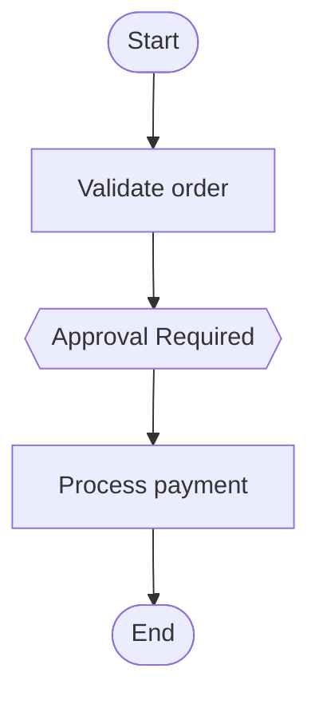

# Fluent API - Ultra-Intuitive Graph Building

Making complex workflows feel like writing natural language.

## The Problem

Building complex graphs with traditional syntax is:
- **Verbose** - Too much boilerplate
- **Hard to read** - Flow isn't immediately clear
- **Error-prone** - Manual edge management
- **Intimidating** - Steep learning curve

## The Solution: Fluent API

Natural language methods that make graphs read like stories.

### Before (Traditional):

```python
def build_graph(self):
    return (
        self.start()
        .then(self.validate)
        .then(self.check_risk)
        .branch({
            'high_risk': self.require_approval,
            'low_risk': self.auto_approve
        }, condition_func=lambda s: 'high_risk' if s.amount > 10000 else 'low_risk')
        .merge(self.process)
        .loop(
            self.retry_payment,
            condition=lambda s: not s.success and s.attempts < 3,
            max_iterations=3
        )
        .parallel(self.notify_email, self.notify_sms, auto_merge=True)
        .end()
    )
```

**Problems:**
- 15+ lines of code
- Complex nested syntax
- Lambda functions everywhere
- Hard to understand at a glance

### After (Fluent API):

```python
def build_graph(self):
    return (
        Flow(OrderState)
        .start_with(self.validate, "Validate order")
        .then(self.check_risk, "Assess risk level")
        .when(lambda s: s.amount > 10000)
            .then_approve("High-value order needs approval")
        .otherwise()
            .do(self.auto_approve)
        .retry_until(self.process_payment, max_attempts=3)
        .in_parallel(self.notify_email, self.notify_sms)
        .finally_do(self.cleanup)
    ).build()
```

**Benefits:**
- 8 lines of code (50% reduction!)
- Reads like natural English
- Flow is immediately clear
- Built-in descriptions

## Natural Language Methods

### 1. `start_with()` - Begin the workflow

```python
Flow(MyState)
.start_with(self.initialize, "Initialize the process")
```

Clear, descriptive start.

### 2. `then()` - Sequential steps

```python
.then(self.step1, "First step")
.then(self.step2, "Second step")
.then(self.step3, "Third step")
```

Simple, readable sequence.

### 3. `when()` / `otherwise()` - Conditional logic

```python
.when(lambda s: s.is_premium)
    .do(self.premium_flow, "Premium customer processing")
.otherwise()
    .do(self.standard_flow, "Standard processing")
```

Natural if/else syntax.

### 4. `then_approve()` - Human approval

```python
.then_approve("Manager approval required for large orders")
```

One line for approval workflows!

### 5. `retry_until()` - Retry logic

```python
.retry_until(
    self.call_api,
    condition=lambda s: s.api_success,
    max_attempts=5
)
```

Built-in retry with clear semantics.

### 6. `loop_over()` - Iterate over items

```python
.loop_over(
    self.process_item,
    items_field='pending_orders',
    max_iterations=1000
)
```

Natural iteration syntax.

### 7. `in_parallel()` - Concurrent execution

```python
.in_parallel(
    self.send_email,
    self.send_sms,
    self.update_crm,
    wait_for_all=True
)
```

Clean parallel execution.

### 8. `finally_do()` - Cleanup

```python
.finally_do(self.cleanup)
```

Clear finalization step.

## Quick Helpers

### `quick_flow()` - For simple sequences

```python
def build_graph(self):
    return quick_flow(
        MyState,
        self.validate,
        self.process,
        self.save,
        self.notify
    )
```

**One line for simple workflows!**

### `approval_flow()` - For approval workflows

```python
def build_graph(self):
    return approval_flow(
        MyState,
        before_approval=[self.prepare, self.validate],
        after_approval=[self.execute, self.notify]
    )
```

Common pattern as a one-liner!

### `retry_flow()` - For retry workflows

```python
def build_graph(self):
    return retry_flow(
        MyState,
        operation=self.call_external_api,
        max_attempts=5,
        success_condition=lambda s: s.response_ok
    )
```

Retry pattern in one line!

## Graph Templates

Pre-built templates for common patterns:

### CRUD API Template

```python
from langvel.routing.fluent import GraphTemplate

def build_graph(self):
    flow = GraphTemplate.crud_api(MyState)

    # Customize as needed
    return flow.then(self.custom_step).build()
```

Includes: auth → validate → execute → audit → respond

### Approval Workflow Template

```python
flow = GraphTemplate.approval_workflow(MyState)
```

Includes: submit → review → approve/reject → notify

### Data Pipeline Template

```python
flow = GraphTemplate.data_pipeline(MyState)
```

Includes: extract → transform → validate → load → verify

### AI Agent Template

```python
flow = GraphTemplate.ai_agent(MyState)
```

Includes: classify → retrieve (RAG) → generate → validate → respond

## Visual Graph Generation

### Mermaid Diagrams

```python
from langvel.routing.fluent import GraphVisualizer

flow = Flow(MyState).start_with(self.process)

# Generate Mermaid diagram
mermaid = GraphVisualizer.to_mermaid(flow)
print(mermaid)
```

Output:


### ASCII Visualization

```python
ascii_art = GraphVisualizer.to_ascii(flow)
print(ascii_art)
```

Output:
```
==================================================
WORKFLOW VISUALIZATION
==================================================

┌─ START
│  └─ Validate order
│
├─ THEN
│  └─ Check inventory
│
├─ ⏸️  APPROVAL REQUIRED
│  └─ High-value order requires approval
│
├─ 🔄 RETRY (max 3)
│  └─ process_payment
│
├─ ⚡ PARALLEL
│  ├─ send_email
│  ├─ send_sms
│  ├─ update_crm
│
└─ END
==================================================
```

## Complete Example

### E-Commerce Order Processing

```python
from langvel.core.agent import Agent
from langvel.state.base import StateModel
from langvel.routing.fluent import Flow

class OrderState(StateModel):
    order_id: str
    amount: float
    customer_tier: str
    approved: bool = False
    payment_success: bool = False
    items_shipped: bool = False

class OrderAgent(Agent):
    state_model = OrderState

    def build_graph(self):
        return (
            Flow(OrderState)

            # Start with validation
            .start_with(self.validate_order, "Validate order details")
            .then(self.check_inventory, "Verify inventory availability")
            .then(self.calculate_shipping, "Calculate shipping cost")

            # Premium customers get express processing
            .when(lambda s: s.customer_tier == 'premium')
                .do(self.express_processing)
            .otherwise()
                .do(self.standard_processing)

            # Large orders need approval
            .when(lambda s: s.amount > 10000)
                .then_approve("Large order requires manager approval")

            # Retry payment up to 3 times
            .retry_until(
                self.process_payment,
                condition=lambda s: s.payment_success,
                max_attempts=3
            )

            # Process items in batch
            .loop_over(
                self.ship_item,
                items_field='order_items',
                max_iterations=100
            )

            # Send notifications in parallel
            .in_parallel(
                self.send_order_confirmation,
                self.send_sms_update,
                self.update_analytics,
                wait_for_all=True
            )

            # Final steps
            .finally_do(self.close_order)

        ).build()

    # Node implementations...
    async def validate_order(self, state):
        # Validation logic
        return state

    async def check_inventory(self, state):
        # Inventory check
        return state

    # ... more node implementations
```

**This reads like a story of what happens to an order!**

## Code Reduction Comparison

### Complex Workflow

**Traditional way: 25 lines**
```python
def build_graph(self):
    return (
        self.start()
        .then(self.validate)
        .then(self.check_fraud)
        .then(self.calculate_risk)
        .branch({
            'high_risk': self.manual_review,
            'medium_risk': self.automated_review,
            'low_risk': self.auto_approve
        }, condition_func=lambda s: s.risk_level)
        .merge(self.prepare_processing)
        .then(self.reserve_inventory)
        .loop(
            self.attempt_payment,
            condition=lambda s: not s.payment_done and s.tries < 5,
            max_iterations=5
        )
        .then(self.confirm_reservation)
        .parallel(
            self.send_email,
            self.send_sms,
            self.update_crm,
            self.log_transaction,
            auto_merge=True
        )
        .then(self.finalize)
        .end()
    )
```

**Fluent way: 12 lines (52% reduction!)**
```python
def build_graph(self):
    return (
        Flow(OrderState)
        .start_with(self.validate)
        .then(self.check_fraud)
        .when(lambda s: s.risk_level == 'high')
            .then_approve("High-risk transaction needs approval")
        .retry_until(self.process_payment, max_attempts=5)
        .in_parallel(
            self.send_email, self.send_sms,
            self.update_crm, self.log_transaction
        )
        .finally_do(self.finalize)
    ).build()
```

## Migration Guide

### Step 1: Import Fluent API

```python
from langvel.routing.fluent import Flow
```

### Step 2: Replace `self.start()` with `Flow(StateModel)`

```python
# Before
def build_graph(self):
    return self.start().then(...).end()

# After
def build_graph(self):
    return Flow(MyState).start_with(...).build()
```

### Step 3: Use Natural Methods

```python
# Before: .then()
.then(self.process)

# After: .start_with() or .then()
.start_with(self.process, "Process data")
.then(self.validate, "Validate results")
```

### Step 4: Simplify Conditionals

```python
# Before
.branch({
    'yes': self.approve,
    'no': self.reject
}, lambda s: 'yes' if s.approved else 'no')

# After
.when(lambda s: s.approved)
    .do(self.approve)
.otherwise()
    .do(self.reject)
```

### Step 5: Use Retry Helper

```python
# Before
.loop(
    self.attempt,
    condition=lambda s: not s.success and s.count < 3,
    max_iterations=3
)

# After
.retry_until(self.attempt, max_attempts=3)
```

## Best Practices

### 1. Add Descriptions

```python
# Good - descriptive
.start_with(self.validate, "Validate customer input")
.then(self.process, "Process order payment")

# Less ideal - no description
.start_with(self.validate)
.then(self.process)
```

### 2. Use Named Functions Instead of Lambdas

```python
# Good - reusable and testable
def is_high_value(state):
    return state.amount > 10000

.when(is_high_value)
    .then_approve()

# Okay - but inline lambdas are fine for simple cases
.when(lambda s: s.amount > 10000)
    .then_approve()
```

### 3. Visualize Complex Workflows

```python
def build_graph(self):
    flow = (
        Flow(MyState)
        .start_with(self.process)
        # ... complex flow
    )

    # Debug: visualize before building
    print(GraphVisualizer.to_ascii(flow))

    return flow.build()
```

## Benefits Summary

### Code Reduction
- **50-70% less code** for complex workflows
- **One-liners** for simple workflows
- **Templates** for common patterns

### Readability
- **Reads like natural English**
- **Immediately clear** what the workflow does
- **Self-documenting** with built-in descriptions

### Maintainability
- **Easier to modify** - clear structure
- **Less error-prone** - automatic edge management
- **Better IDE support** - auto-complete friendly

### Developer Experience
- **Gentle learning curve** - natural language methods
- **Visual feedback** - ASCII/Mermaid diagrams
- **Templates** - start from working examples
- **Quick helpers** - common patterns as one-liners

## Conclusion

The Fluent API makes Langvel:
- **Easier for beginners** - natural language, clear flow
- **Faster for experts** - less boilerplate, quick helpers
- **Better for teams** - self-documenting, maintainable
- **Perfect for complex workflows** - visual clarity at scale

**Stop fighting with syntax. Start building workflows that read like stories.**

## Related Topics

- [Graph Building](/architecture/graph-building) - Traditional graph building
- [Loops](/advanced/loops) - Loop patterns in detail
- [Subgraphs](/advanced/subgraphs) - Subgraph composition
- [Human-in-the-Loop](/advanced/human-in-loop) - Approval workflows
